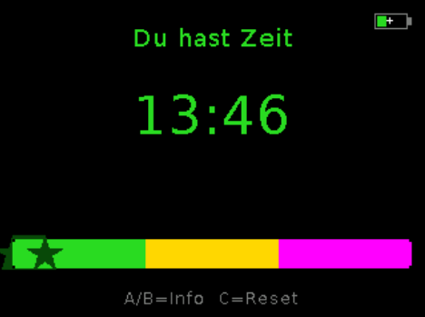
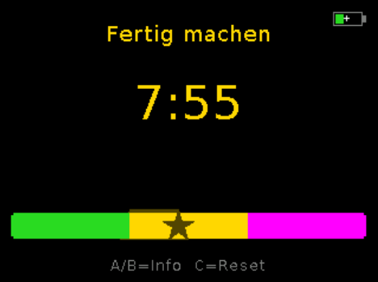
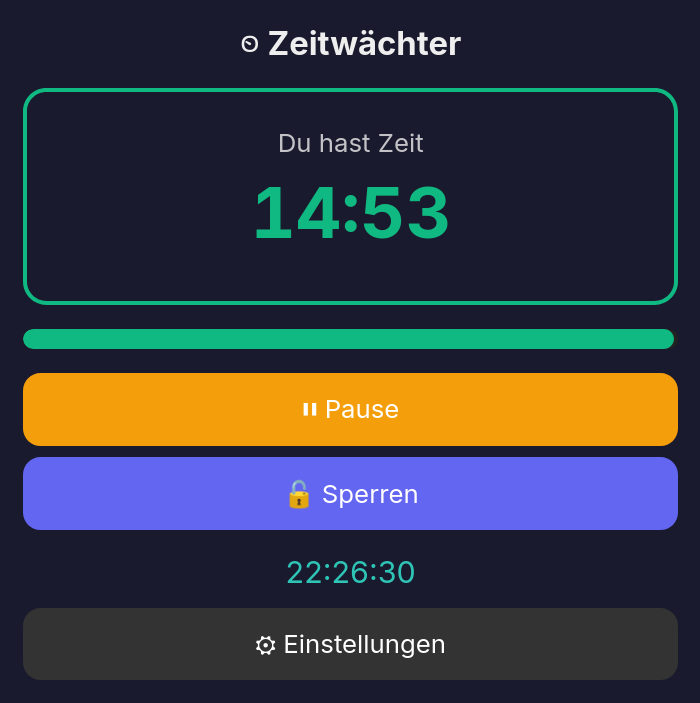
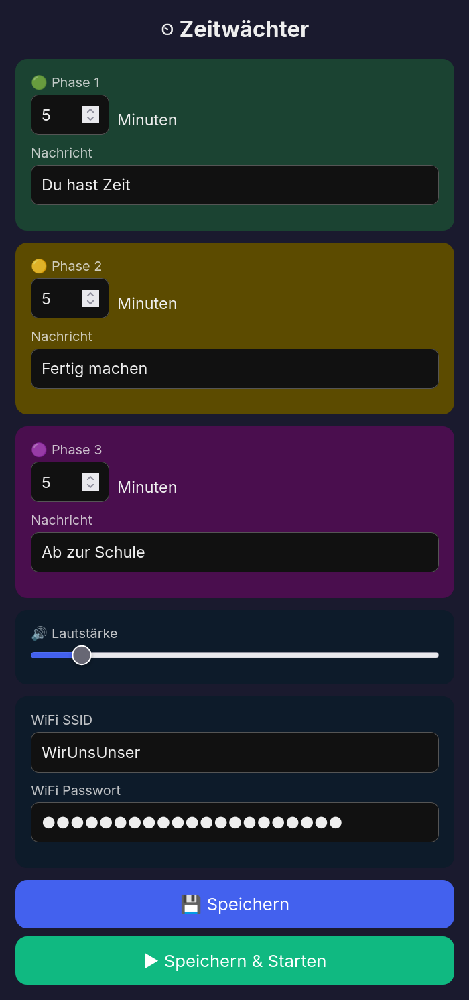

<p align="center">
  <!-- TODO: add logo -->
  <h1 align="center">Zeitwächter</h1>
  <p align="center">A 3-phase visual timer for kids on M5Stack.<br>Green → yellow → magenta. No clock reading required.</p>
</p>

<p align="center">
  
  
  
  
</p>

## What's this?

Zeitwächter helps kids understand time without being able to read a
clock. Three color phases (green, yellow, magenta) turn an abstract
countdown into something a child can feel. Green means plenty of time,
yellow means start wrapping up, magenta means it's almost over.

Use it for morning routines (chill, get dressed and brush teeth, jacket
on and head to school), homework blocks, or "how long till dinner" so
your kid can plan their playing. Parents set durations and messages per
phase via a web UI on their phone. The device is child-proof during
operation.

Inspired by the [AURIOL Time Tracker](https://www.discounto.de/Angebot/AURIOL-Time-Tracker-mit-digitaler-Anzeige-9969069/) concept,
built on M5Stack hardware.

## Hardware

Currently runs on **M5Stack CoreS3** (ESP32-S3, 2" IPS display, battery,
speaker, touch buttons). M5Dial support planned.

## Features

- **3-phase countdown**: configurable durations per phase (1-120 minutes each)
- **Color-coded display**: green/yellow/magenta with phase-specific messages
- **3-phase progress bar**: shows all phases proportionally, dims elapsed time
- **Web UI** at `http://zeitwaechter.local`, configure phases, messages, volume
- **Live remote control**: pause, resume, stop, lock buttons from phone
- **Child-proof**: physical buttons locked via web UI, BtnB acknowledges alarm
- **Auto-dim**: screen dims after 30s idle, wakes on interaction or phase change
- **Power-optimized**: 80MHz CPU, WiFi modem sleep, Bluetooth disabled
- **Battery indicator**: real-time charge level and charging state
- **Speaker volume control**: adjustable via web UI, saved to flash
- **WiFi AP fallback**: creates "TimeTracker" AP on first boot or if WiFi fails to connect
- **NVS persistence**: all settings saved across reboots
- **DejaVu fonts**: readable text with auto-fit and word-wrap

## Setup

### Prerequisites

- [PlatformIO](https://platformio.org/) (`pipx install platformio`)
- M5Stack CoreS3 connected via USB-C

### Build & Flash

```bash
git clone git@github.com:EnTeQuAk/zeitwächter.git
cd zeitwächter
pio run                         # build firmware
pio run -t upload               # flash to device
```

If `pio run -t upload` has port issues (common with ESP32-S3 JTAG),
flash directly:

```bash
python ~/.platformio/packages/tool-esptoolpy/esptool.py \
  --chip esp32s3 --port /dev/ttyACM0 --baud 1500000 \
  --before default_reset --after hard_reset \
  write_flash -z --flash_mode dio --flash_freq 80m --flash_size 16MB \
  0x10000 .pio/build/m5cores3/firmware.bin
```

### First Boot

1. Device creates a WiFi AP named **TimeTracker** (no password)
2. Connect your phone to the AP
3. Open `http://192.168.4.1` in your browser
4. Enter your home WiFi credentials and save
5. Device reboots and connects to your WiFi
6. Access the web UI at `http://zeitwaechter.local`

If you ever enter wrong WiFi credentials, the device falls back to the
TimeTracker AP after 15 seconds so you can fix them.

## Usage

### Web UI (parent)

Open `http://zeitwaechter.local` on your phone:

- Set phase durations (minutes) and messages per phase
- Adjust speaker volume
- **Save** to store settings, **Save & Start** to also begin the countdown

While the timer runs, the web UI switches to a control panel:

- Live remaining time and progress bar
- Pause / Resume
- Lock / Unlock device buttons
- Stop (acknowledge alarm)
- Current time display

### Device Buttons

| Button | Idle | Running | Done |
|--------|------|---------|------|
| **A** (left) | Start timer | Show remaining | |
| **B** (middle) | | Show remaining | Acknowledge |
| **C** (right, long) | Reset | Reset | Reset |

All buttons can be locked via the web UI for full child-proofing.

## Architecture

```
src/
├── main.cpp        # setup/loop, button handling, state machine
├── config.h/cpp    # TimerConfig struct, NVS persistence, display geometry
├── timer.h/cpp     # 3-phase countdown state machine with pause/resume
├── display.h/cpp   # DejaVu fonts, phase bar, battery indicator, auto-fit text
└── webserver.h/cpp # WiFi, mDNS, web UI (config + live control), REST API
```

- **Timer**: Phase state machine (IDLE, GREEN, YELLOW, FINAL, DONE, PAUSED)
- **Display**: Partial redraws, only full screen clear on phase change
- **Web**: HTML served from PROGMEM, JS polls `/status` for live updates
- **Config**: Preferences library (NVS flash), validated on load

## Power Management

- CPU downclocked to 80MHz (plenty for a timer and webserver)
- WiFi modem sleep between beacons
- Bluetooth radio disabled
- Display auto-dims after 30s idle, wakes on interaction or phase change
- Battery reads throttled to once per minute

## API

`GET /status` returns JSON with timer state, battery info:

```json
{
  "phase": "GREEN",
  "remaining": 832,
  "total": 1800,
  "locked": false,
  "message": "Alles gut!",
  "battery": 65,
  "charging": true,
  "voltage": 3950,
  "current_ma": 0,
  "vbus_mv": 4925,
  "brightness": 80
}
```

| Endpoint | Method | Description |
|----------|--------|-------------|
| `/` | GET | Web UI |
| `/save` | POST | Save config (add `start=1` to also start timer) |
| `/pause` | POST | Pause countdown |
| `/resume` | POST | Resume countdown |
| `/stop` | POST | Stop timer / acknowledge alarm |
| `/lock` | POST | Toggle button lock |
| `/status` | GET | Timer state + battery JSON |
| `/screenshot` | GET | BMP screenshot of the current display |

## License

MIT
